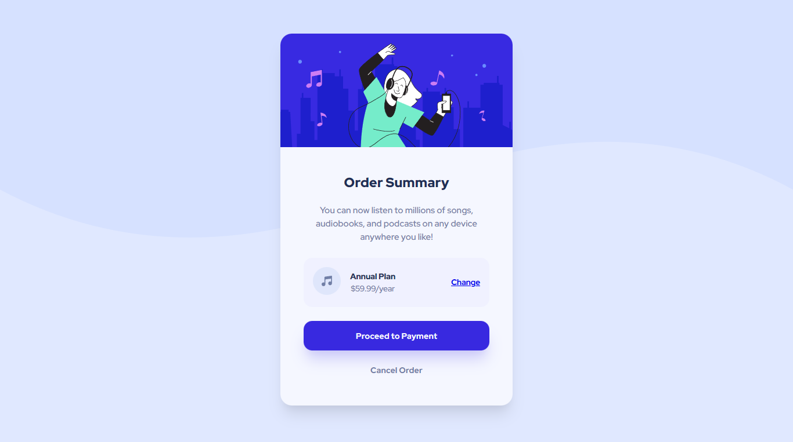

# Order Summary Card

This is a solution to the [Order summary card challenge on Frontend Mentor](https://www.frontendmentor.io/challenges/order-summary-component-QlPmajDUj). Frontend Mentor challenges help you improve your coding skills by building realistic projects.

## Screenshot

## Links

- [Live Site URL](https://order-summary-0x.netlify.app)
- [View Solution on Frontend Mentor](https://www.frontendmentor.io/solutions/order-summary-component-FVwjMaEUMk)
